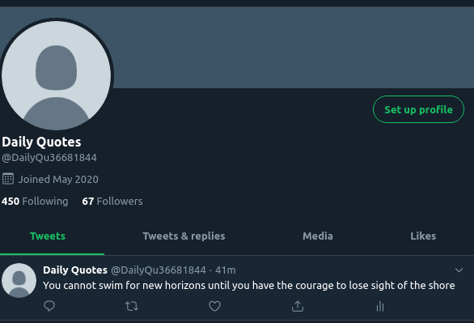
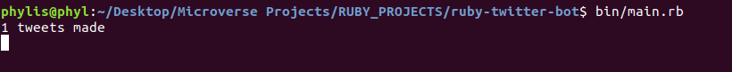

# Twitter Bot Written in Ruby

This is a twitter bot written with the Ruby language. Its main fuction is to post tweets, retweet specifics with a given hashtag and follow them.

### How it works

- It checks for given tweets and updates its status on twitter
- It then looks for #Motivation
- It picks the firt 10tweets with the hashtag and retweets
- It then picks two tweets made with #motivation hashtag and follows the user back

## Getting Started

To get a local copy up and running follow these simple example steps.

#### Prerequisites

- Ruby
- Twitter Developer account
- API keys[Access keys](https://developer.twitter.com/en/apply-for-access)

#### Setup

- Clone the repository into your local machine.
- Install all the dependencies using bundle install
- Rename .env-template file in bin directory to .env and provide your API keys.
- Run main.rb in bin directory.

### Confirmation that the first tweet is made

### A tweet already posted

## Built with

- Ruby
- Twitter API

## Author

👤 **Phylis Chepchumba**

- Github: [@Phlylis05](https://github.com/phlylis05)
- Linkedin: [Phylis Chepchumba](https://linkedin.com/PhylisChepchumba)
- Twitter: [chepchumba05](https://twitter.com/chepchumba05)

## 🤝 Contributing

Contributions, issues and feature requests are welcome! Start by:

- Forking the project
- Cloning the project to your local machine
- `cd` into the project directory
- Run `git checkout -b your-branch-name`
- Make your contributions
- Push your branch up to your forked repository
- Open a Pull Request with a detailed description to the development branch of the original project for a review

## Show your support

Give a ⭐️ if you like this project!

## Acknowledgents

- Microverse
- Twitter